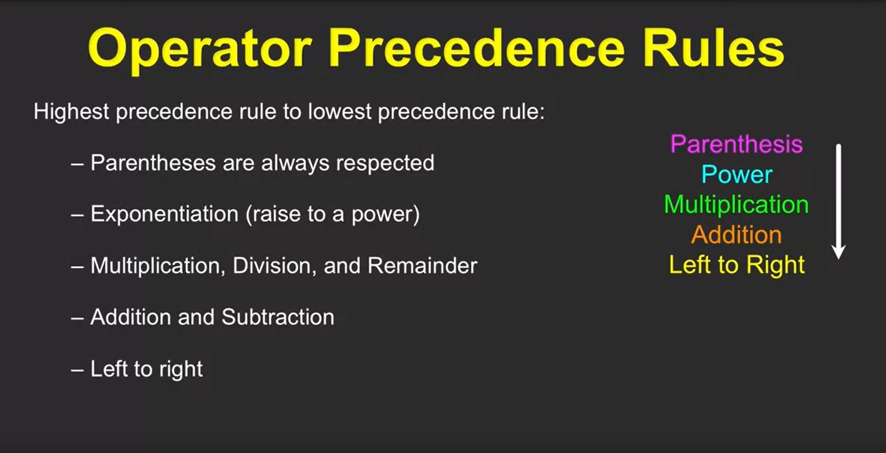
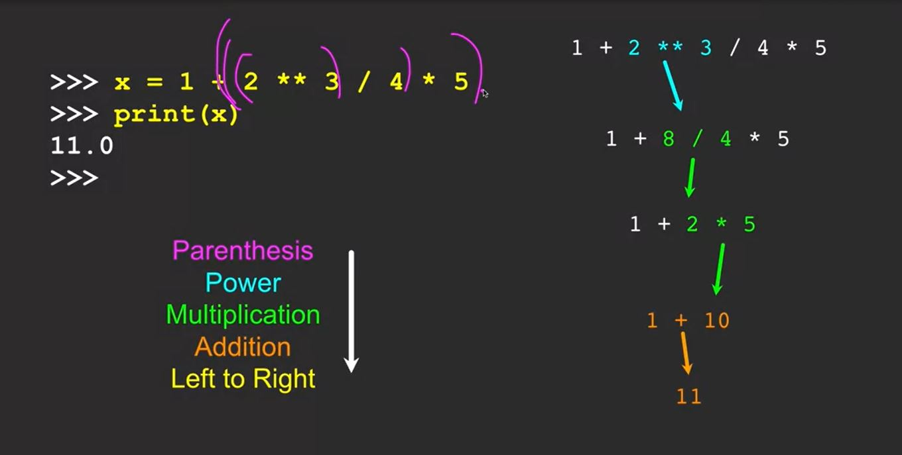

# Python for everyone
## Reserved words
| ---    | ---    | ---    | ---    | ---      |
| ------ | ------ | ------ | ------ | -------- |
| False  | class  | return | is     | finally  |
| None   | if     | for    | lambda | continue |
| and    | def    | form   | while  | nonlocal |
| as     | elif   | try    | or     | yield    |
| assert | else   | import | pass   |
| break  | except | in     | raise  |

## Numeric Expressions
| Operator | Operation      |
| -------- | -------------- |
| -        | Subtraction    |
| *        | Multiplication |
| /        | Division       |
| **       | Power          |
| %        | Remainder      |

#### Python3: when we use division its autometicly forcefully converted to float 

## Operator Precedence

### Example


### Concatenate
```python
name = 'Mahmudul ' + 'Hasan ' + 'Reza'
print(name)
```
#### output
```python
Mahmudul Hasan Reza
```
### Type
```python
print(type(1))
print(type(1.03))
print(type(name))
```
#### output
```python
<class 'int'>
<class 'float'>
<class 'str'>
```

### Type Conversions
```python
print(float(99) + 100)
i = 40
f = float(i)
print(f)
print(type(f))
```
#### output
```python
199.0
40.0
<class 'float'>
```
### string conversion 
```python
s = '123'
ss = int(s) + 1
print(ss)
print(type(ss))
```
#### output
```python
124
<class 'int'>
```
### user input
```python
l_name = input("whats your last name?\n")
print('welcome', l_name)
```
#### output
```python
whats your last name?
Reza
welcome Reza
<class 'int'>
```

**# Every user input we have to convert(type conversion) to our desire data type because python always takes input as string**

**2.2** Write a program that uses input to prompt a user for their name and then welcomes them. Note that input will pop up a dialog box. Enter Sarah in the pop-up box when you are prompted so your output will match the desired output.

```python
name = input("Enter your name")
print("Hello", name)
```
#### output
```python
# input
Sarah

# output
Hello Sarah
```
**2.3** Write a program to prompt the user for hours and rate per hour using input to compute gross pay. Use 35 hours and a rate of 2.75 per hour to test the program (the pay should be 96.25). You should use input to read a string and float() to convert the string to a number. Do not worry about error checking or bad user data.

```python
hrs = input("Enter Hours:")
hrs = int(hrs)
rate = input("Enter Rate:")
rate = float(rate)
pay = hrs * rate
print('Pay:', pay)
```
#### output
```python
# input
35
2.75

# output
Pay: 96.25
<class 'int'>
```


**3.1** Write a program to prompt the user for hours and rate per hour using input to compute gross pay. Pay the hourly rate for the hours up to 40 and 1.5 times the hourly rate for all hours worked above 40 hours. Use 45 hours and a rate of 10.50 per hour to test the program (the pay should be 498.75). You should use input to read a string and float() to convert the string to a number. Do not worry about error checking the user input - assume the user types numbers properly.

```python
hrs = input("Enter Hours:")
rate = input("Enter Rate:")
try:
    h = float(hrs)
    rate = float(rate)
except:
    print('Enter Numeric Number')
if(h > 40):
    extra = h - 40
    extra = extra * (rate * 1.5)
    rate = 40 * rate
    pay = rate + extra
    print(pay)
else:
    pay = h * rate
    print(pay)
```
#### output
```python
Enter Hours:45
Enter Rate:10.5
498.75
```
**3.3** Write a program to prompt for a score between 0.0 and 1.0. If the score is out of range, print an error. If the score is between 0.0 and 1.0, print a grade using the following table:
| Score  | Grade |
| ------ | ----- |
| >= 0.9 | A     |
| >= 0.8 | B     |
| >= 0.7 | C     |
| >= 0.6 | D     |
| < 0.6  | F     |
If the user enters a value out of range, print a suitable error message and exit. For the test, enter a score of 0.85.

```python
score = input('Enter score: ')
try: 
    score = float(score)
except:
    print('Enter a numeric number')
if(score > 1.0):
    print('Inputed Score is out of range')
elif(score >= 0.9 and score <= 1.0):
    print('A')
elif(score >= 0.8):
    print('B')
elif(score >= 0.7):
    print('C')
elif(score >= 0.6):
    print('D')
elif(score < 0.6 and score >= 0.0):
    print('F')
else:
    print('Inputed Score is out of range')
```
#### output
```python
Enter score: 1.0
A
```